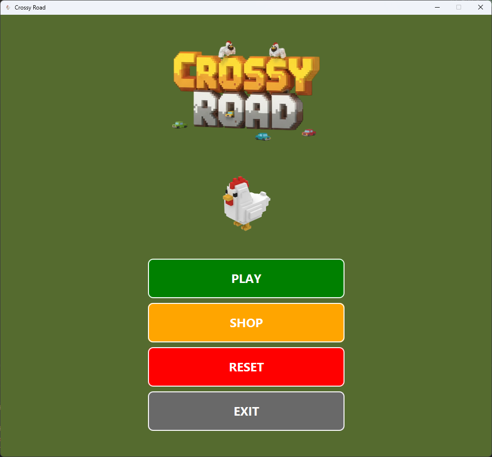
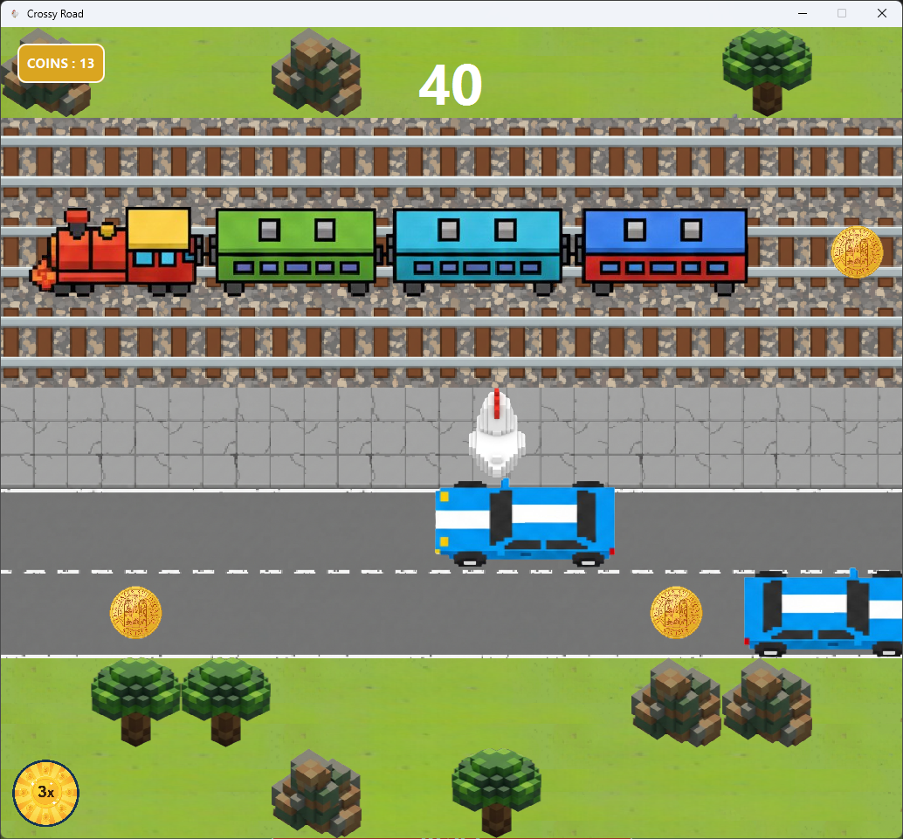
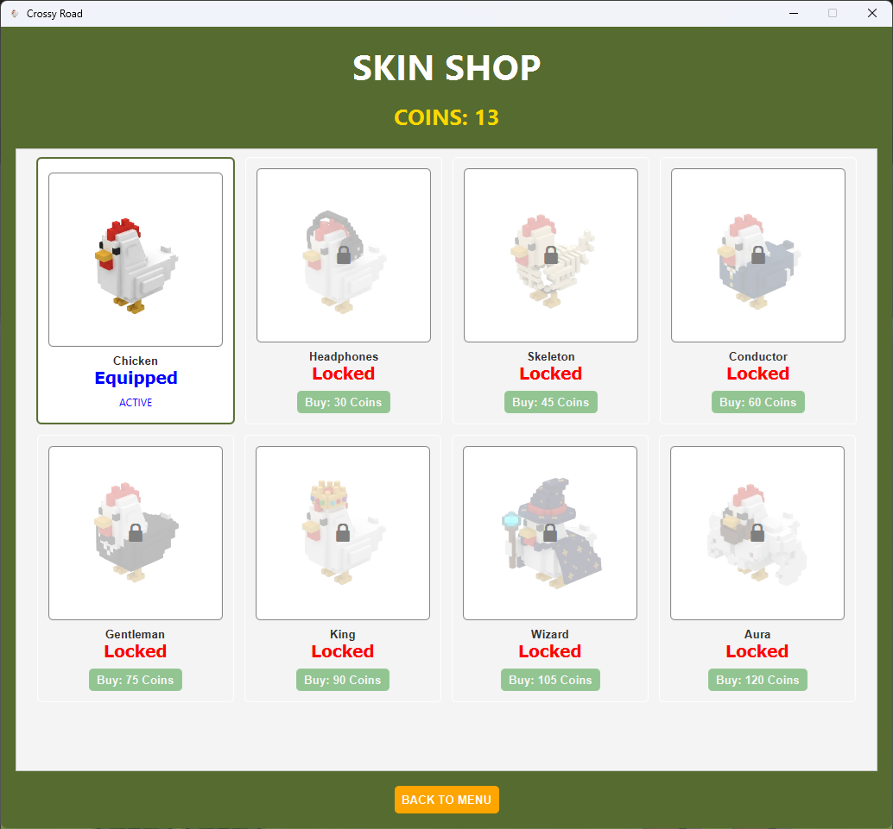

  

# Demo

  

    
    
Menu

  

  

    
    
Game

  

  

    
    
Shop

  

# Team

Team member emails:

* giuliano.manzi@studio.unibo.it
* lorenzo.baldazzi2@studio.unibo.it
* alessio.magnani@studio.unibo.it
* mattia.golinucci2@studio.unibo.it

# Project description

The group aims to create a replica of the video game "Crossy Road" in which the player must maneuver a character and try to get it safely to the other side of the road. Along the way, there are passive obstacles (trees, rocks, etc.) and active obstacles (cars, trains) that the player must avoid. In addition to obstacles along the path, the player can collect coins that allow unlocking new characters at the end of the game. The game is an endless runner, meaning it continues until the player loses, without a predetermined end.

This game is very popular due to its simple and intuitive mechanics, which do not make it trivial. It is an endless runner version of the 1980s video game Frogger, which sold over 20 million copies worldwide. This project aims to create a modern version in Java.

Minimal mandatory features (achievable in approximately 60–70% of the available time):

* Character control
* Endless map with random generation
* Random generation and movement of active obstacles
* Coin/character system
* Start/pause menu

Optional features (to complete 100% of the available time):

* Random generation of passive obstacles
* New active obstacle: river with logs for crossing
* Scoring system
* Placement of power-ups along the path
* Game state saving

Main "challenges":

* Implementing a game loop
* GUI requires careful attention for quality and smoothness
* Combining various elements requires thoughtful design

Rough work distribution (with significant modeling tasks for each):

* Manzi: map generation; passive obstacle generation
* Baldazzi: coin/character system; start/pause menu; adding power-ups; saving game state
* Magnani: character management and movement; adding river
* Golinucci: active obstacle generation and movement; scoring system

# Commands
>In-game commands:

- Use W,A,S,D or ↑,←,↓,→ to move the player, use Esc to reach the menu. Step on a coin or a power-up to pick it up.